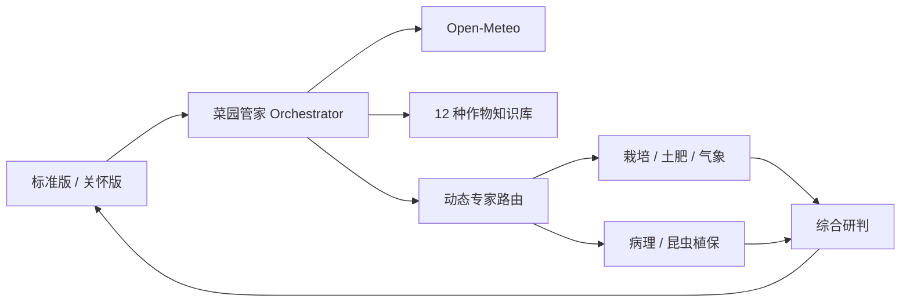

# 菜园守护 · Garden Guardian

面向全国家庭种植者的多专家 AI 菜园管家。产品将实时天气、作物阶段、养护记录和多学科分析组合成清晰的今日任务，并提供最多三图的植物问题辅助诊断。

## 真实实现与演示边界

真实实现：

- Open-Meteo 城市搜索、实时天气和七日预报
- 12 种重点作物结构化知识卡与可追溯来源
- 通义千问文本／视觉模型接口
- 动态专家路由、并行分析、综合研判与失败降级
- 今日任务、完成记录、日历导出、多图诊断
- 标准版、关怀版、语音输入和语音朗读
- 30 个可执行基础评测案例

交互演示：

- 自由问答
- 家人跨设备代管
- 小程序、语音设备和浏览器扩展等未来入口

未配置百炼密钥时，页面会明确进入规则降级模式，不会把规则输出伪装成 AI 分析，也不会将图片发送给第三方。

## 技术架构



- Next.js 15、React 19、TypeScript、Tailwind CSS
- 百炼 OpenAI 兼容接口：`qwen-plus-latest`、`qwen-vl-plus-latest`
- 浏览器 `localStorage` 保存菜园档案和任务；植物图片不持久化
- Upstash Redis 生产限流；未配置时使用进程内限流

## 本地运行

1. 安装 Node.js 20 以上和 pnpm。
2. 复制 `.env.example` 为 `.env.local`。
3. 填写百炼密钥；Upstash 变量可选。
4. 运行：

```bash
pnpm install
pnpm dev
```

环境变量：

```text
DASHSCOPE_API_KEY=
QWEN_TEXT_MODEL=qwen-plus-latest
QWEN_VISION_MODEL=qwen-vl-plus-latest
UPSTASH_REDIS_REST_URL=
UPSTASH_REDIS_REST_TOKEN=
NEXT_PUBLIC_SITE_URL=http://localhost:3000
```

密钥只在服务端使用，不能提交到 GitHub。

## 验证

```bash
pnpm typecheck
pnpm test
pnpm build
```

基础评测由 15 个天气任务、12 个症状路由和 3 个信息不足案例组成。它验证规则和路由，不代表病害模型准确率。完整结果见 `/evaluation`。

## 安全边界

- 最多三张 JPG、PNG 或 WebP，总大小不超过 6MB
- 客户端压缩后再上传，服务端不持久化图片
- 不提供无依据的精确农药剂量
- 信息不足时降低置信度并追问
- 严重或快速恶化时建议咨询当地农技人员

## 已知限制

- 关怀版语音识别依赖浏览器，主要面向最新版 Chrome
- 家人代管目前为交互演示，没有账户或跨设备同步
- 本地结构化知识库不是向量数据库，也没有模型微调
- 公开上线前需配置百炼密钥；建议配置 Upstash 防止接口滥用
